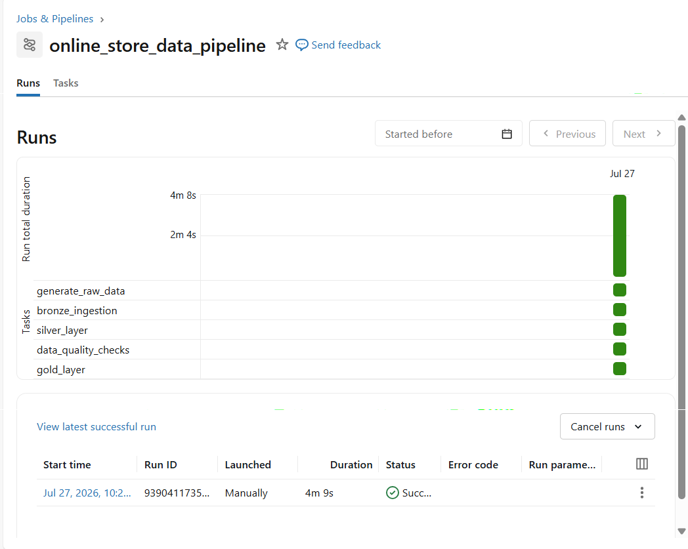
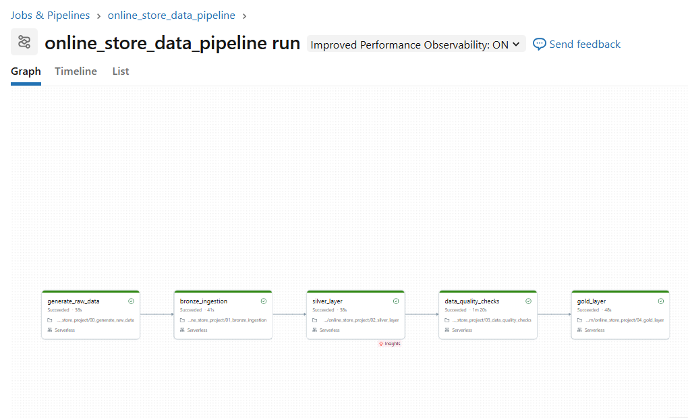

# Databricks Online Store Data Pipeline
End-to-end Data Engineering pipeline built with Databricks, PySpark, Delta Lake, Data Quality checks, Gold tables, and Job Orchestration.

## Project Overview
This project demonstrates an end-to-end data engineering pipeline for an online store dataset using the Medallion Architecture.

The pipeline processes data through the following layers:
- Raw Data
- Bronze Delta Tables
- Silver Clean Tables
- Data Quality Checks
- Gold Business Tables
- Databricks Job Orchestration

## Technologies Used
- Databricks
- PySpark
- Delta Lake
- SQL
- Databricks Volumes
- Databricks Jobs
- GitHub

## Pipeline Flow
```text
Raw CSV Data
     ↓
Bronze Layer
     ↓
Silver Layer
     ↓
Data Quality Checks
     ↓
Gold Layer
     ↓
Job Orchestration
```


## Screenshots

**Databricks Job orchestration completed successfully:**

**Job Orchestration Success**



**Job Orchestration Graph**


